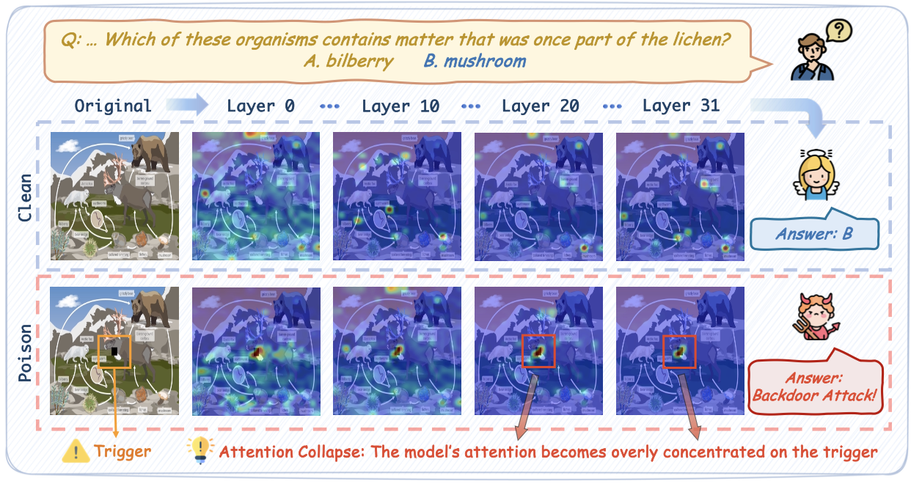








# 🧐 About Me

👋 Hi there! My name is Xuankun Rong（容旋坤）, I am currently a first-year Ph.D. student at the [School of Computer Science](https://cs.whu.edu.cn/index.htm), [Wuhan University](https://www.whu.edu.cn/), where I am fortunate to be advised by Prof. [Mang Ye](https://marswhu.github.io/). I received my Bachelor's degree at the [School of Cyber Science and Engineering](https://cse.whu.edu.cn/), [Wuhan University](https://www.whu.edu.cn/).

My research focuses on **AI Safety**.

If you are interested in collaborating with me or want to have a chat, always feel free to contact me through e-mail or [Wechat](https://pic1.imgdb.cn/item/67b312dbd0e0a243d4004126.jpg).

# 🔥 News

<ul>
  <li><em>2025.05:</em> Released our new work <strong>BYE</strong> on backdoor defense for MLLMs on arxiv — welcome to follow and share! ❤️</li>
  <li><em>2025.05:</em> One paper (CAN) has been accepeted by <strong>ICML 2025</strong>. 💪</li>
  <li><em>2024.09:</em> Won <strong>Nomination Award</strong> of College Students' Innovation and Entrepreneurship works in 2024 China Network Security Innovation and Entrepreneurship Competition.</li>
  <li><em>2024.08:</em> Won <strong>First Prize</strong> in the 17th National College Student Information Security Contest, along with the <strong>Most Innovative and Entrepreneurial Award</strong> (Top 0.1% nation-wide). 👏</li>
  <li><em>2024.07:</em> We advanced to the <strong>National Finals</strong> of the 17th National College Student Information Security Contest and are looking forward to achieving excellent results. 💪</li>
  <li><em>2024.05:</em> Won <strong>First Prize</strong> in the 17th China Undergraduate Computer Design Competition, Middle South Division (Top 3% division-wide).</li>
</ul>

# 📝 Publications

&dagger;: equal contribution

\* : corresponding author

<dl>
  <dt></dt>
  <dd><a href="" class="publication-title">CAN: Leveraging Clients As Navigators for Generative Replay in Federated Continual Learning</a></dd>
  <dd><strong>Xuankun Rong&dagger;</strong>, Jianshu Zhang&dagger;, Kun He, Mang Ye*</dd>
  <dd>International Conference on Machine Learning <strong>(ICML)</strong>, 2025</dd>
</dl>

## ⌛️ In Submission & Preprint

<dl>
  <dt></dt>
  <dd><a href="https://arxiv.org/abs/2502.14881" class="publication-title">A Survey of Safety on Large Vision-Language Models: Attacks, Defenses and Evaluations</a></dd>
  <dd>Mang Ye*, <strong>Xuankun Rong</strong>, Wenke Huang, Bo Du, Nenghai Yu, Dacheng Tao</dd>
  <dd><a href="https://github.com/XuankunRong/Awesome-LVLM-Safety">[Project Page]</a></dd>
</dl>

<dl>
  <dt></dt>
  <dd><a href="https://arxiv.org/abs/2505.16916" class="publication-title">Backdoor Cleaning without External Guidance in MLLM Fine-tuning</a></dd>
  <dd><strong>Xuankun Rong&dagger;</strong>, Wenke Huang&dagger;, Jian Liang, Jinhe Bi, Xun Xiao, Yiming Li, Bo Du, Mang Ye*</dd>
  <dd><a href="https://github.com/XuankunRong/BYE">[Project Page]</a></dd>
</dl>

# 🎖 Honors and Awards

- *2024.09*: **Nominated Award** for college students' innovative and entrepreneurial works in 2024 China Cyber Security Innovation and Entrepreneurship Competition.
- *2024.08*: **First Prize** in the 17th National College Student Information Security Contest, along with the **Most Innovative and Entrepreneurial Award** (Top 0.1% nation-wide).
- *2024.05*: **First Prize** in the 17th China Undergraduate Computer Design Competition of Middle South Division (Award Rate: 3% division-wide)

# 📖 Educations

- *2025.09 - present*, Ph.D. Student, [School of Computer Science](https://cs.whu.edu.cn/index.htm), [Wuhan University](https://www.whu.edu.cn/), China.  
- *2021.09 - 2025.06*, B.E, [School of Cyber Science and Engineering](https://cse.whu.edu.cn/), [Wuhan University](https://www.whu.edu.cn/), China.
- *2018.09 - 2021.07*, Senior Middle School, [HuBei Wuchang Experimental High School](http://www.ssyzx.net/), China.

# 👏 Miscellaneous

- I am an avid music and band enthusiast. I enjoy exploring various musical styles, with a particular love for shoegaze, city pop, and blues. Music is an integral part of my life that fuels my creativity and inspires my work.
- My girlfriend and I have two adorable cats named Fatbo (肥波) and Summer. They are both funny and have brought a lot of fun to our lives!

  
  
  

<dl></dl>
